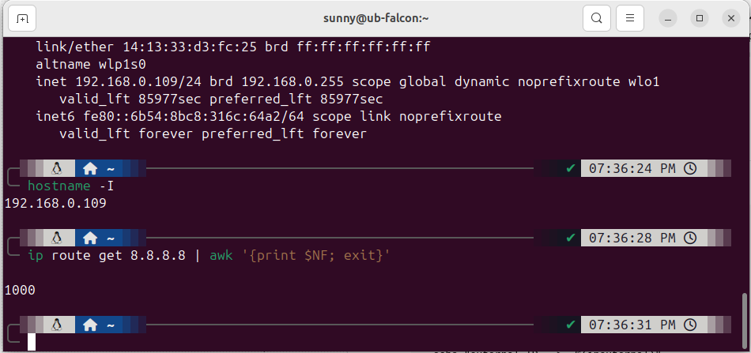

#  :memo: Customized Your Terminal 
show note from This youtube Channel ->   

  

<!--  -->

  

### Install ZSH
`sudo apt install zsh`
### Set zsh as default
`chsh -s $(which zsh)`
### in gnome terminal
> **profile custom command**    

### zsh default themes
https://github.com/ohmyzsh/ohmyzsh/wiki/Themes

>> **ToDo:  &nbsp;&nbsp; edit  &nbsp; .zshrc &nbsp; file**  
 &nbsp;&nbsp;&nbsp;&nbsp;  _ZSH_THEME="jonathan"_      
&nbsp;&nbsp;&nbsp;&nbsp; -[suggested by me]

### Install ohmyzsh
`sh -c "$(curl -fsSL https://raw.githubusercontent.com/ohmyzsh/ohmyzsh/master/tools/install.sh)"`

### Zsh Must-Have Plugin
`git clone https://github.com/zsh-users/zsh-autosuggestions.git $ZSH_CUSTOM/plugins/zsh-autosuggestions`

`git clone https://github.com/zsh-users/zsh-syntax-highlighting.git $ZSH_CUSTOM/plugins/zsh-syntax-highlighting`

>> **ToDo:  &nbsp;&nbsp; edit  &nbsp; .zshrc file to include plugins**  
 &nbsp;&nbsp;&nbsp;&nbsp;  _plugins=(git zsh-autosuggestions zsh-syntax-highlighting)_      
&nbsp;&nbsp;&nbsp;&nbsp; -[suggested by me try once more plugin like history]

<!-- edit .zshrc to include plugins
plugins=(git zsh-autosuggestions zsh-syntax-highlighting) -->

### plugins include with ohmyzsh
https://github.com/ohmyzsh/ohmyzsh/wiki/Plugins

### Nerd Font
https://www.nerdfonts.com/

https://github.com/ryanoasis/nerd-fonts/tree/master/patched-fonts/FiraMono

_download and install firamono for linux_

### Install Powerlevel 10k
`git clone https://github.com/romkatv/powerlevel10k.git $ZSH_CUSTOM/themes/powerlevel10k`

>> **ToDo:**  
 **&nbsp;&nbsp;&nbsp;&nbsp; edit  &nbsp; .zshrc file**  
 &nbsp;&nbsp;&nbsp;&nbsp;  _ZSH_THEME="powerlevel10k/powerlevel10k"_      
  &nbsp;&nbsp;&nbsp;&nbsp;  _POWERLEVEL9K_MODE="nerdfont-complete"_   

<!-- edit .zshrc

ZSH_THEME="powerlevel10k/powerlevel10k"

POWERLEVEL9K_MODE="nerdfont-complete" -->
